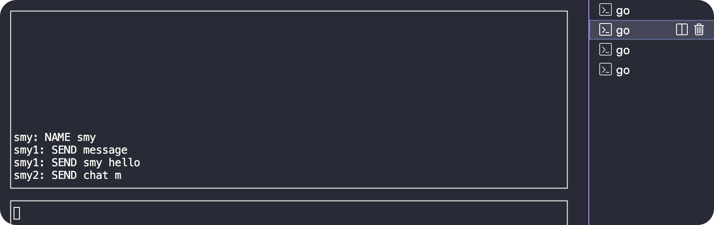

# Chat Server Imp. With Golang
A simple chat server written in Golang, with very basic features:
- There is only a single chat room for now
- User can connect to the chat server
- User can set their name
- User can send message to the chat room

# Communi. Protocol

For this excersie will use simple text-based message over TCP:

- All message are terminatd with \n
- To send a chat message, client will send:
  - SEND chat message
  - chat message can not contain new line.
- To set client name, client will send:
  - NAME username
  - user name can not contain space
- Server will send the following command to all clients when there are new message:
  - MESSAGE username the actual message

Later will try protobuf, or Gob to write protocol.

# Run.

1. run server
`go run server/cmd/main.go`

2. run client (in multiple ternimal)
`go run tui/cmd/main.go -server=localhost:3333`

