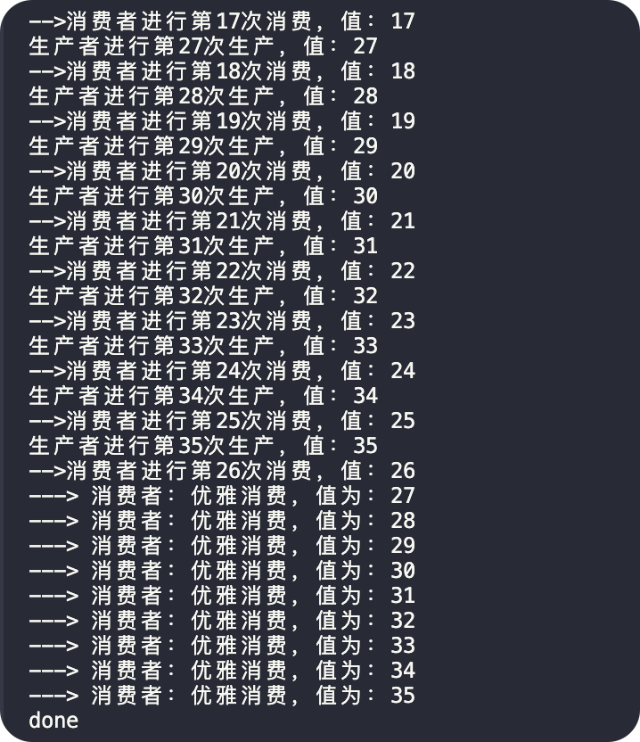

# Introduction

Learning golang's producer-consumer model

## timeout: 3 Ways to Implement Timeouts in the Go Language

- main1.go: 使用两个通道，一个通道用于收发数据，一个无缓冲的信号通道（直到关闭该通道时才触发所在 case），另外使用到了一个秒级定时器，一秒钟消费一次
`go run timeout/main1.go`
- main2.go: 使用定时器设置主 goroutine 等待最大超时，相比于 `time.Sleep` 要优雅一些
`go run timeout/main2.go`
- main3.go: 使用 golang 的 context 类型，支持自定义超时上下文
`go run timeout/main3.go -m wb`
`go run timeout/main3.go -m je`

